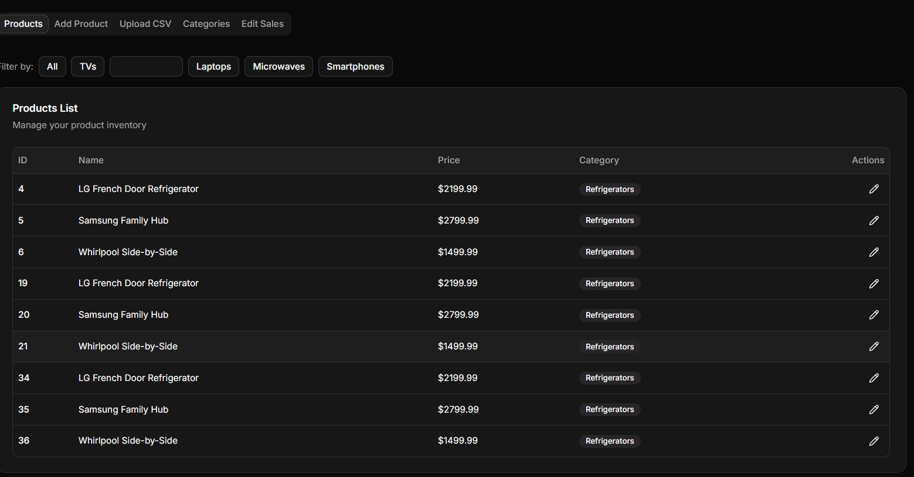
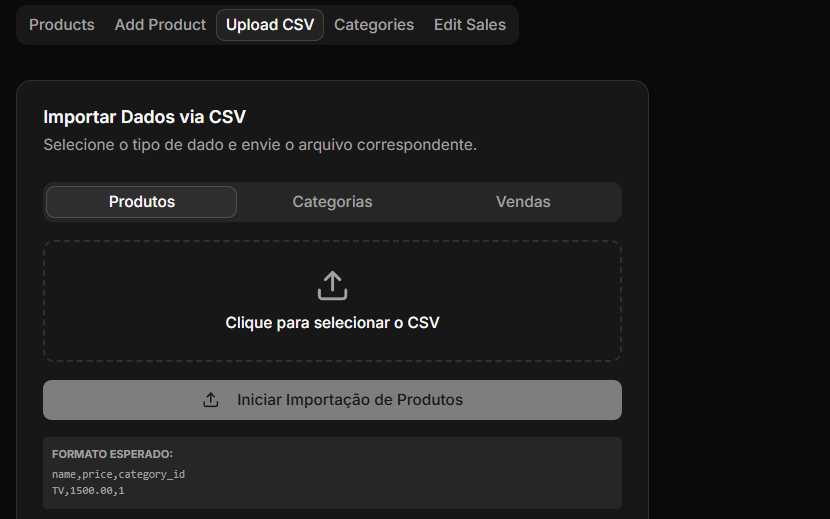
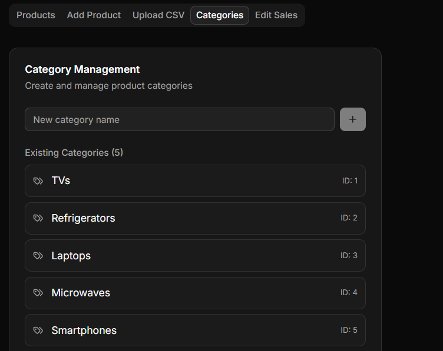
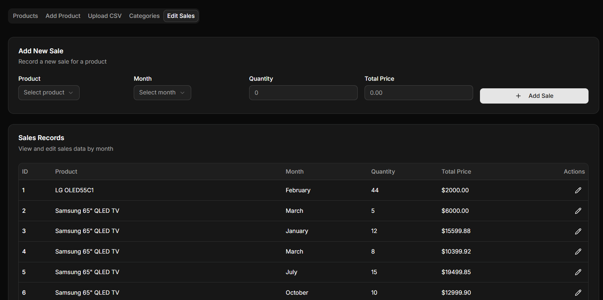

# SmartMart_Solutions
Esta é a documentação completa para configurar, rodar e entender a estrutura do projeto SmartMart Solutions.

Documentation: SmartMart Solutions Project
Este projeto é uma aplicação Full Stack para gerenciamento de vendas e produtos, composta por um Backend em Python (FastAPI) e um Frontend em React (Next.js) com suporte a importação de dados via CSV e visualização de dashboards.

🚀 Como Rodar o Projeto
1. Pré-requisitos
Python 3.10+ instalado.

Node.js 18+ e npm/yarn instalados.

2. Configurando o Backend (Python/FastAPI)
Navegue até a pasta do backend:

Bash

cd backend
Crie e ative um ambiente virtual:

Bash

python -m venv venv
# No Windows:
venv\Scripts\activate
# No Linux/Mac:
source venv/bin/activate
Instale as dependências:

Bash

pip install fastapi uvicorn sqlalchemy pandas
Inicie o servidor:

Bash

uvicorn app.main:app --reload
O servidor estará rodando em: http://127.0.0.1:8000

Documentação interativa (Swagger): http://127.0.0.1:8000/docs

3. Configurando o Frontend (Next.js/React)
Navegue até a pasta do frontend:

Bash

cd frontend
Instale as dependências:

Bash

npm install
Configure as variáveis de ambiente: Crie um arquivo .env.local na raiz da pasta frontend:

Fragmento do código

NEXT_PUBLIC_API_URL=http://127.0.0.1:8000
Inicie o projeto em modo desenvolvimento:

Bash

npm run dev
Acesse: http://localhost:3000

